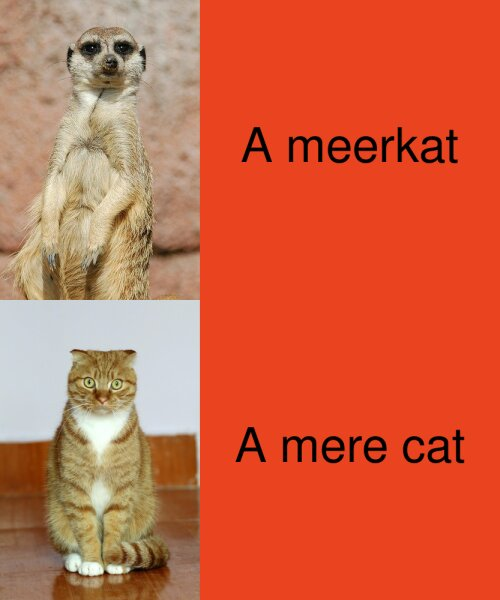

# Creation of a meme using R studio and the Magick package

1. Think of an idea- my motivation was something funny and animal related. Having just been to the Zoo, meerkats were on my mind.[^1]
2. Choose images off pixaby.com
3. Use Magick package functions to code and format meme in R studio

[^1]: After creating the meme and searching for others like it I realised the concept of the joke must've been subconsciously stored in my head from seeing similar memes.


## My meme 



## The coding for my meme
```
{
library(magick)

#square 1
meerkat <- image_read("https://cdn.pixabay.com/photo/2013/07/13/14/12/meerkat-162217_1280.jpg") %>% 
  image_crop("333X500+500+200") 

#square 2
cat <- image_read("https://cdn.pixabay.com/photo/2020/04/07/07/28/big-eyes-5012394_1280.jpg") %>% 
  image_scale("x500")
  
#square 3
meerkat_text <- image_blank(width = 500, 
                            height = 500, 
                            color = "#EA431F") %>%
  image_annotate(text = "A meerkat", 
                 color = "#000000",
                 size = 80,
                 font = "impact",
                 gravity = "center")

#square 4
mere_cat_text <- image_blank(width = 500, 
                             height = 500, 
                             color = "#EA431F") %>%
  image_annotate(text = "A mere cat", 
                 color = "#000000",
                 size = 80,
                 font = "impact",
                 gravity = "center")

#making each row
meerkat_vector <- c(meerkat, meerkat_text)
top_row <- image_append(meerkat_vector)

cat_vector <- c(cat, mere_cat_text)
bottom_row <- image_append(cat_vector)

#combining rows
meme <- c(top_row, bottom_row) %>%
  image_append(stack = TRUE) %>%
  image_scale(500)

#save image
image_write(meme, "my_meme.png")
}
```
